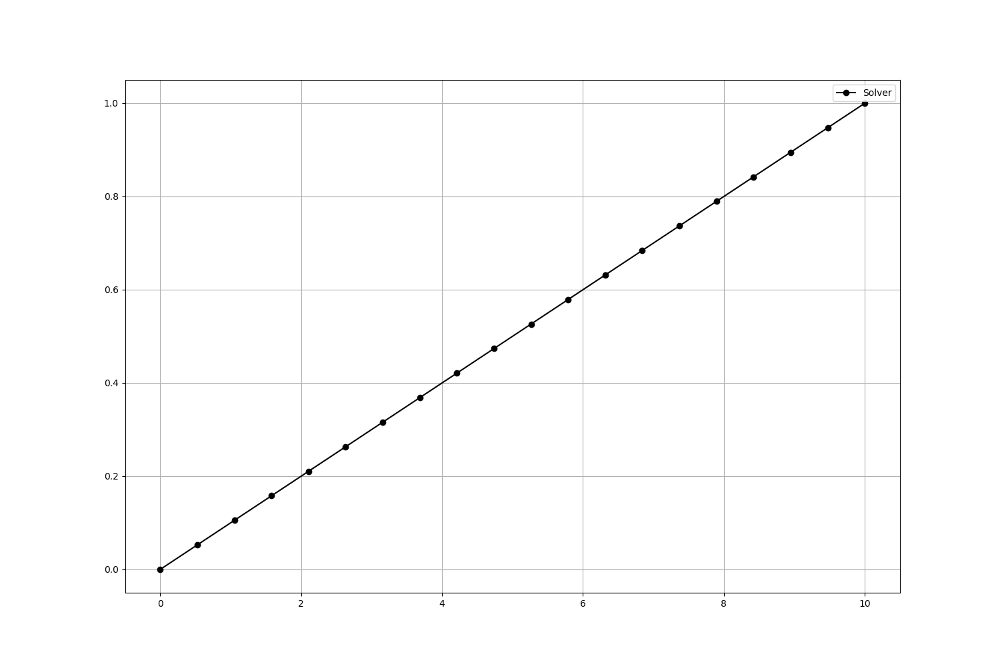
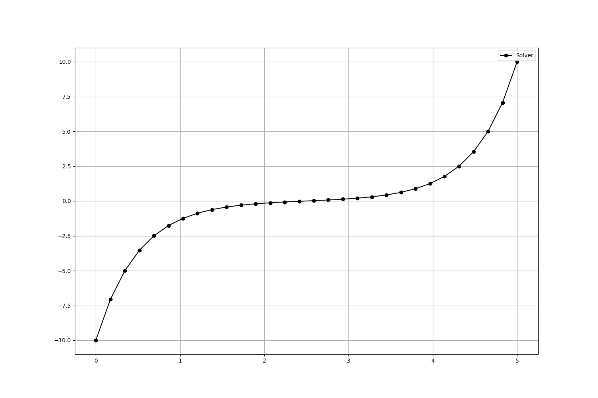
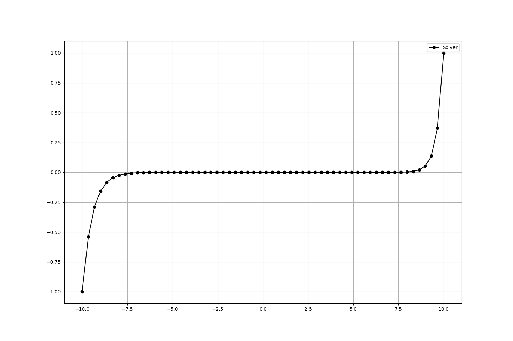
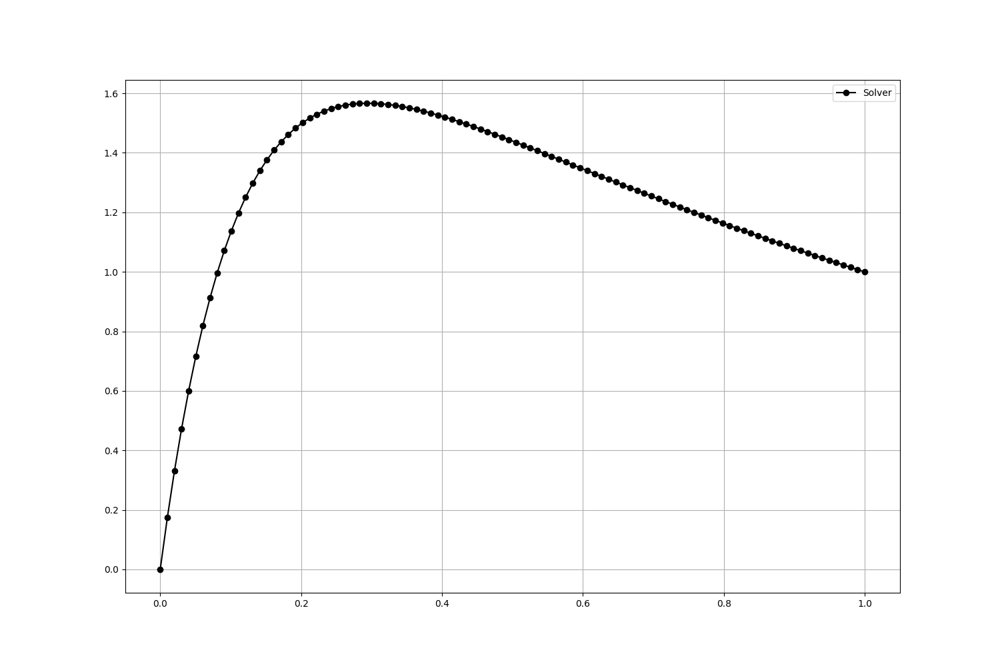
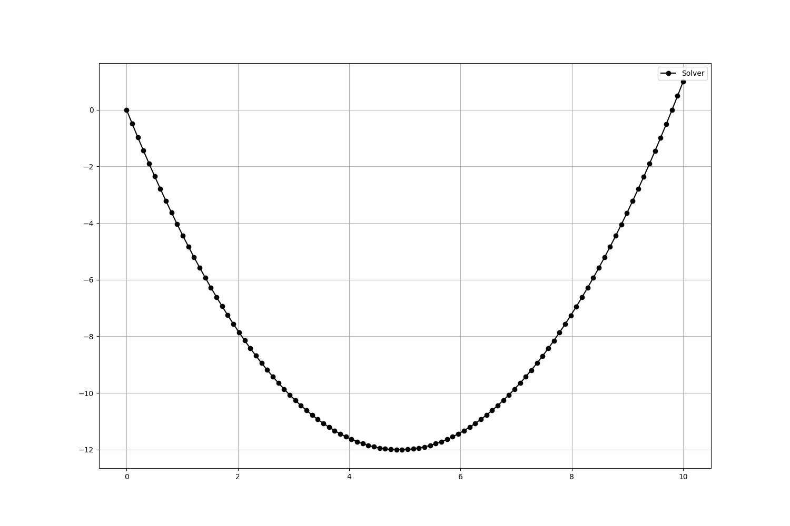
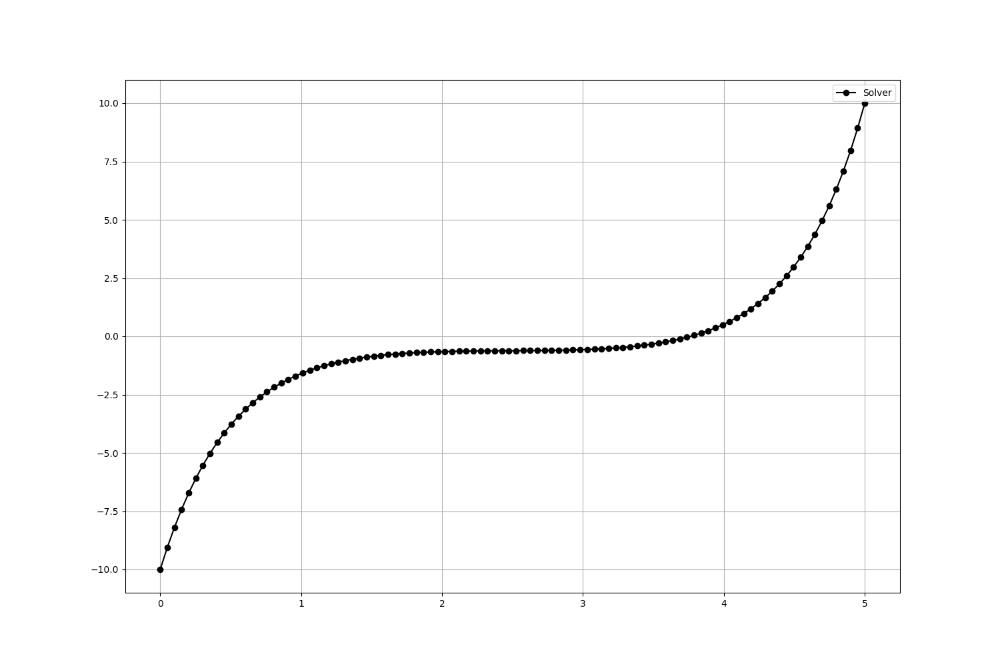
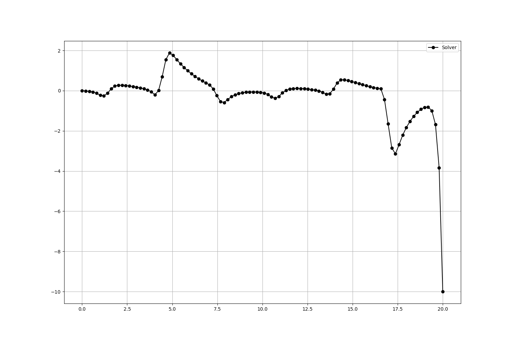
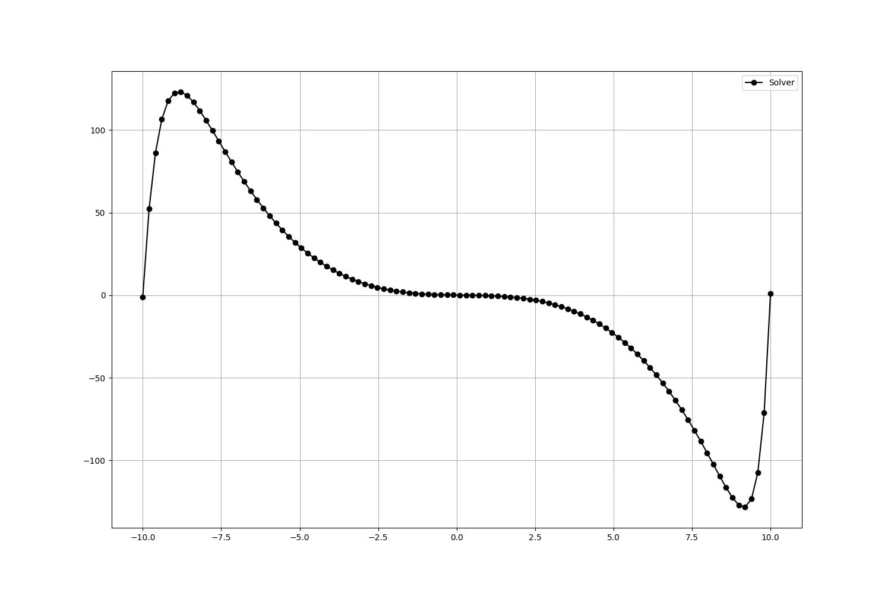
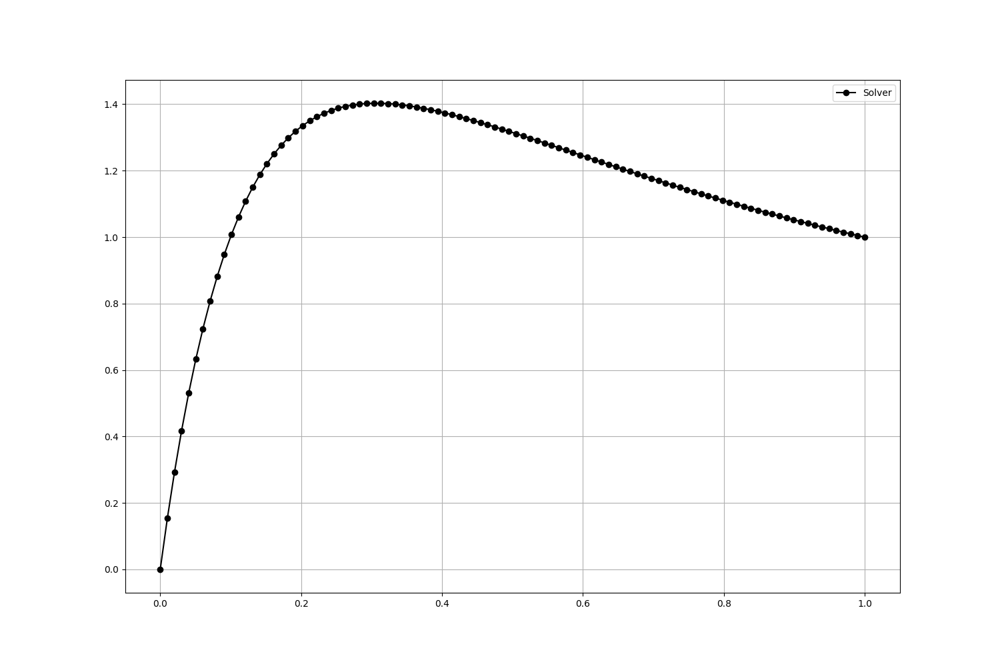

# Oridnary Differential Equation FEA Solver

This repository holds the codebase for the ordinary differntial equation (ODE) solver.
The solver currently solves equations of the form:

$$ \frac{d^2 y}{dx^2} + a\frac{dy}{dx} + by = f(x) $$

Where $ a $ and $ b $ are constants.
$ f(x) $ can either be zero, or any continuous or piecewise-continous function.

Given that this is a second-order differential equation, two initial conditions are required to get a specific solution function.
These can either be Dirchlet or Neumann BCs; for this solver, two Dirichelet BCs are assumed on the boundaries.

## Using the Solver

The solver is a command-line utility.
It has the usage syntax `solver.out [A] [B] [d1] [d2] [function field file] [start] [end] [number of elements]`.
All inputs are required.

Inputs `A` and `B` represent the constants.
`[d1]` and `[d2]` are the Dirichlet values at the boundaries of the mesh domain
The `[function field file]` input is a `.dat` file that is a tabulated version of the function.
This can be trivially generated. 
Note that the delimiter of the `.dat` file should be a tab (`\t`) character.
(See the `example/predefined_fields` directory for examples.)

This version of the solver features a very basic mesh generator in the executable.
(The mesh is a simple 1D mesh with only coordinates in order; see the `input_mesh.in` file when running the solver executable.)
The mesh inputs `[start]`, `[end]`, and `[number of elements]` should represent the mesh over the entire desired domain with a specificed number of elements.

When ran, the solver will output two files: `input_mesh.in` and `solution_output.dat`.
The mesh file is simply outputted for debugging and tracking purposes; the solution file is the coordiantes of the mesh with the solution points with it.
Again, the `.dat` file has a tab character as the delimiter.
This file can be directly graphed; the `grapher.py` file can also graph and output a `results.png` file from this solution file.

## Buliding the Solver and Solver Tests

To build the main executable and the FEA ODE API library (the executable links against this static archive), simply run:

```bash
make
```

Note that GSL *must* be preinstalled on the machine.
It should be installed the normal system directory.
If not install, for Linux, run

```bash
sudo apt install libgsl-dev
```

To build the tests, run the following:

```bash
cd test
make
```

Note that GSL and Check (for tests) * must be preinstalled on the machine.
If not installed, for Linux, run

```bash
sudo apt install libgsl-dev
sudo apt-get install check
```

## Examples in Predefined Fields

In this repository, there are a set of predefined fields in the `predefined_fields` directory.
The below tabls gives the function defined with the file name.

| Function | File Name |
|:--------:|:---------:|
|$$ f(x) = \cos{x} $$| `cosine_field.dat`|
|$$ f(x) = x^3 $$|`cubic_field.dat`|
|$$ f(x) = e^x $$|`exponential_field.dat`|
|$$ f(x) = x $$|`linear_field.dat`|
|$$ f(x) = \ln{x} $$|`natural_log_field.dat`|
|$$ f(x) = e^{-x} $$|`negative_exponential_field.dat`|
|$$ f(x) = x^2 $$|`quadratic_field.dat`|
|$$ f(x) = \sin{x} $$|`sine_field.dat`|
|$$ f(x) = \tan{x} $$|`tangent_field.dat`|
|$$ f(x) = 1 $$|`unity_field.dat`|
|$$ f(x) = 0 $$|`zero_field.dat`|

## Examples

The following are some examples to showcase the solver's abilities.
These examples use the field files from the `predefined_fields` directory.

### Homogenous Cases

#### Case 1

Equation:

$$ \frac{d^2 y}{dx^2} = 0 $$

Domain:

$$ [0, 10], \ f(0) = 0, \ f(10) = 1 $$

Command:

```bash
./solver.out 0 0 0 1 predefined_fields/zero_field.dat 0 10 20
```



#### Case 2

Equation:

$$ \frac{d^2 y}{dx^2} - 4y = 0 $$

Domain:

$$ [0, 5], \ f(0) = -10, \ f(5) = 10 $$

Command:

```bash
./solver.out 0 -4 -10 10 predefined_fields/zero_field.dat 0 5 30
```



#### Case 3

Equation:

$$ \frac{d^2 y}{dx^2} - 4\frac{dy}{dx} - 4y = 0 $$

Domain:

$$ [0, 20], \ f(0) = 0, \ f(20) = -10 $$

Command:

```bsah
./solver.out -4 -4 0 -10 predefined_fields/zero_field.dat 0 20 150
```


#### Case 4

Equation:

$$ \frac{d^2 y}{dx^2} - 1\frac{dy}{dx} - 5y = 0 $$

Domain:

$$ [-10, 10], \ f(-10) = -1, \ f(10) = 1 $$

Command:

```bash
./solver.out -1 -5 -1 1 predefined_fields/zero_field.dat -10 10 60
```



#### Case 5

Equation:

$$ \frac{d^2 y}{dx^2} + 10\frac{dy}{dx} + 7y = 0 $$

Domain:

$$ [0, 1], \ f(0) = 0, \ f(1) = 1 $$

Command:

```bash
./solver.out 10 7 0 1 predefined_fields/zero_field.dat 0 1 100
```



### Nonhomogenous Cases

#### Case 1

Equation:

$$ \frac{d^2 y}{dx^2} = 1 $$

Domain:

$$ [0, 10], \ f(0) = 0, \ f(10) = 1 $$

Command:

```bash
./solver.out 0 0 0 1 predefined_fields/unity_field.dat 0 10 100
```



#### Case 2

Equation:

$$ \frac{d^2 y}{dx^2} - 4y = x $$

Domain:

$$ [0, 5], \ f(0) = -10, \ f(5) = 10 $$

Command:

```bash
./solver.out 0 -4 -10 10 predefined_fields/linear_field.dat 0 5 100
```



#### Case 3

Equation:

$$ \frac{d^2 y}{dx^2} - 4\frac{dy}{dx} - 4y = \tan{(x)} $$

Domain:

$$ [0, 20], \ f(0) = 0, \ f(20) = -10 $$

Command:

```bash
./solver.out -4 -4 0 -10 predefined_fields/tangent_field.dat 0 20 100
```



#### Case 4

Equation:

$$ \frac{d^2 y}{dx^2} - 1\frac{dy}{dx} - 5y = x^3 $$

Domain:

$$ [-10, 10], \ f(-10) = -1, \ f(10) = 1 $$

Command:

```bash
./solver.out -1 -5 -1 1 predefined_fields/cubic_field.dat -10 10 100
```



#### Case 5

Equation:

$$ \frac{d^2 y}{dx^2} + 10\frac{dy}{dx} + 7y = e^x $$

Domain:

$$ [0, 1], \ f(0) = 0, \ f(1) = 1 $$

Command:

```bash
./solver.out 10 7 0 1 predefined_fields/exponential_field.dat 0 1 100
```



## License
MIT License — see the LICENSE file for details.


